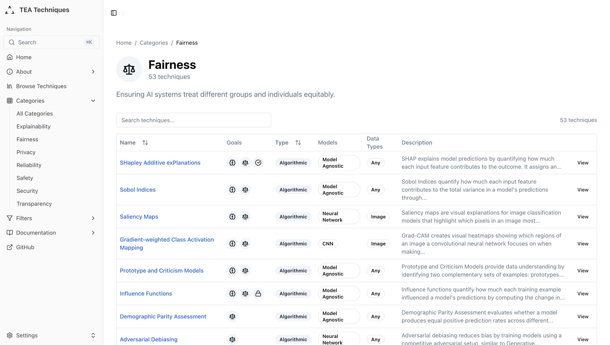
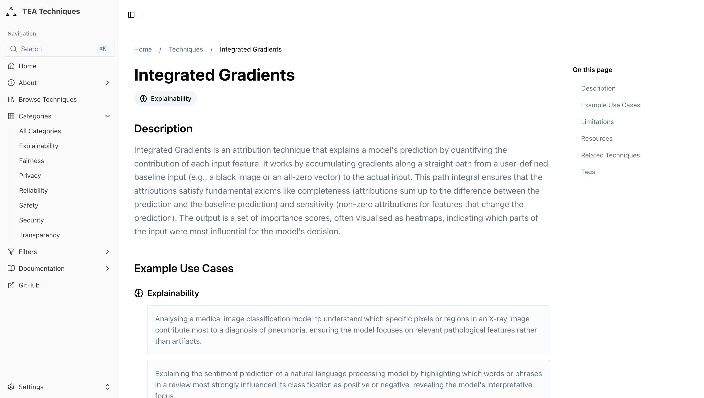

---
title:
  'TEA Techniques: An Interactive Database for Trustworthy and Ethical AI
  Assurance'
author:
  - 'Christopher Burr'
  - 'Levan Bokeria'
institute: 'The Alan Turing Institute'
email:
  - 'cburr@turing.ac.uk'
  - 'lbokeria@turing.ac.uk'
date: '30th July 2025'
abstract: |
  In this paper we present Trustworthy and EThical Assurance (TEA) Techniques, an interactive and community-centred dataset containing nearly 100 curated techniques for assuring artificial intelligence (AI) systems. The dataset organises techniques around the assurance goals they support, including explainability, fairness, safety, security, and more. It also provides structured metadata through an extensible tag system (e.g. 'applicable models', 'expertise needed'). To ensure each technique provides actionable guidance to AI practitioners and researchers, high-quality resources are also made available (e.g. official software packages, journal articles, tutorials). We explain how these resources were discovered through a systematic resource discovery pipeline, and also set out our plans for ensuring the interactive application will remain up-to-date as new advances and methods emerge. The platform is made freely available and open source as a static web application to provide AI professionals, practitioners, and researchers with immediate access to actionable techniques for building robust AI assurance cases. The TEA Techniques database represents a significant step towards building a more inclusive and flourishing AI assurance ecosystem, fostering community-driven
  development of responsible AI practices.
keywords:
  - AI assurance
  - trustworthy AI
  - responsible AI
  - ethical AI
  - explainable AI
  - AI fairness
bibliography-title: 'References'
reference-section-title: 'References'
lang: en-GB
numbersections: true
---

# Introduction {#sec:introduction}

The deployment of artificial intelligence (AI) systems across key sectors of
critical national infrastructure (CNI) demands an urgent and systematic approach
to evidencing their trustworthiness and ethical alignment. While considerable
progress has been made in developing principles and frameworks for responsible
AI [@brundage2020toward; @raji2020closing], practitioners continue to struggle
with identifying and implementing concrete techniques that can generate
meaningful evidence for AI assurance claims. For instance, many now know that AI
can create and exacerbate biases and discriminatory impacts, but may struggle to
know which technique they should use to mitigate these biases and how to
appropriately communicate the processes to affected stakeholder or impacted
users.

This gap between high-level normative principles and actionable methods is well
recognised, and represents a significant barrier to the widespread adoption of
responsible AI practices. Fortunately, a considerable amount of research effort
has gone into developing techniques for different AI assurance techniques. But
now the challenge is how to navigate the slightly fragmented landscape.

Techniques for explainable AI, bias assessment and mitigation, privacy
preservation, and other assurance goals are scattered across academic
literature, software repositories, technical blogs, and proprietary
documentation. Practitioners seeking to build comprehensive assurance cases must
navigate this dispersed knowledge base, often lacking the time or expertise to
evaluate the relevance and quality of available resources or to appropriately
determine whether the technique they have identified is the best one for their
specific use case. Moreover, the rapid evolution of AI technologies means that
new techniques emerge constantly, and existing methods may become outdated or
superseded.

To address these challenges, we present _TEA Techniques_: an interactive
database designed to improve access to practical methods for evidencing claims
about responsible AI design, development, and deployment. Currently, the
database contains approximately 100 techniques[^approximate] organised around
seven core assurance goals: explainability, fairness, privacy, reliability,
safety, security, and transparency.

[^approximate]:
    At the time of submisison, the exact number is 92. However, we report an
    approximate number as this figure is likely to change over time.

Each technique is presented with a description, example use cases, set of
limitations, list of related techniques, external sources (e.g. software
packages and tutorials) and further enriched with structured metadata (i.e.
tags).

In this paper we motivate and introduce the TEA techniques dataset, explaining
its contribution to the AI assurance ecosystem, and how we hope it will be
leveraged and enhanced by the AI community. Specifically, the TEA techniques
dataset has been designed with the following intended contributions in mind:

1. **A curated and structured dataset of AI assurance techniques** approximately
   100 AI assurance techniques with rich metadata, addressing the fragmentation
   of knowledge in this domain.
2. **An open, accessible platform** that provides both interactive web access
   and programmatic interfaces, facilitating integration into diverse
   practitioner workflows.
3. **A foundation for community-driven development** of AI assurance methods,
   with planned features for user contributions, extensibility, and
   collaborative refinement.

The remainder of this paper is organised as follows. Section \ref{sec:background}
situates TEA Techniques within existing AI assurance frameworks
and related repositories. Section \ref{sec:dataset} describes
the dataset structure, core assurance goals, tagging system, and interactive web
application architecture. Section \ref{sec:discovery} details
the systematic methodology and automated pipeline used to identify and curate
high-quality resources. Section \ref{sec:technical} covers
the static site generation approach and API-like data access. Section \ref{sec:usecases} presents practitioner workflows and application
scenarios. Section \ref{sec:future}
discusses plans for community contributions, platform extensibility, and
addressing current dataset imbalances. Finally, Section \ref{sec:conclusion}
reflects on the platform's contributions and potential impact on the AI
assurance ecosystem.

# Background and Related Work {#sec:background}

The field of AI assurance has emerged from the convergence of multiple
disciplines, each contributing unique perspectives on how to ensure AI systems
operate in a way that promotes and builds trust. This section situates TEA
Techniques within the broader landscape of responsible AI initiatives, examining
existing frameworks, resources, and the specific gaps our work addresses.

## AI Assurance and Trustworthiness Frameworks {#sec:frameworks}

The concept of AI assurance draws heavily from established practices in
safety-critical systems engineering and safety case development. It is from this
context that argument-based assurance cases have long been used to demonstrate
system properties [@burr2022ethical].

\colorbox{yellow}{TODO: Add more citations to GSN and York's work}

These structured arguments link evidential artefacts (e.g. reports, test
results) to specific claims about some property of a system or process,
providing clear reasoning about how an overarching goal has been realised.
However, applying argument-based assurance to AI system design, development, and
deployment presents unique challenges due to several interlocking factors, such
as their probabilistic nature, opacity, and potential for emergent behaviours.

Several high-profile initiatives have attempted to establish guidance for
trustworthy AI, specifically using the language of _AI assurance_.

The UK's Department for Science, Innovation and Technology (DSIT) published
comprehensive guidance on AI assurance in February 2024, providing an accessible
introduction to assurance mechanisms and global technical standards
[@dsit2024introduction]. This guidance supports the UK's pro-innovation approach
to AI regulation, establishing key concepts and terms within the broader AI
governance landscape.

Australia has developed a National Framework for AI Assurance in Government,
established through collaboration between federal and state governments
[@dta2024framework]. This framework establishes nationally consistent,
principles-based approaches to AI assurance that prioritise human oversight and
the rights and wellbeing of communities, with specific assessment processes for
high-impact AI use cases.

\colorbox{yellow}{TODO: Mention other key initiatives (US NIST, EU, Singapore) - highlight "risk management" over "assurance"}

## Existing Technique Collections and Databases

In addition to high-level frameworks, various efforts have been made to
catalogue AI techniques relevant to assurance goals.

### General Purpose Examples

1. The AI Incident Database documents failures and harms from deployed AI
   systems, providing valuable lessons but not proactive techniques for
   prevention. \colorbox{yellow}{TODO: add citation}
2. The Partnership on AI's publication repository contains numerous reports and
   best practices, though these are primarily narrative documents rather than
   structured, actionable techniques. \colorbox{yellow}{TODO: add citation}
3. The UK Government's Portfolio of AI Assurance Techniques, developed by the
   Responsible Technology Adoption Unit (RTA), showcases real-world examples of
   AI assurance techniques across multiple sectors [@ukgov2024portfolio]. This
   portfolio maps techniques to the principles outlined in the UK government's
   AI regulation white paper, illustrating how different approaches can support
   wider AI governance.
4. The OECD/GPAI Catalogue of Tools and Metrics for Trustworthy AI provides a
   comprehensive platform where AI practitioners worldwide can discover and
   share tools, metrics, and use cases for developing trustworthy AI systems
   [@oecd2024catalogue]. The catalogue encompasses technical tools, metrics for
   measuring AI trustworthiness, and real-world applications across fairness,
   transparency, explainability, robustness, safety, and security.

### Goal-Specific Examples

1. IBM's AI Fairness 360 (AIF360) offers an extensible open-source library
   containing over 70 fairness metrics and bias mitigation algorithms across the
   AI lifecycle, available in both Python and R [@bellamy2019ai]. The toolkit
   includes preprocessing approaches like reweighing and disparate impact
   removal, in-processing methods such as adversarial debiasing, and
   post-processing techniques like equalized odds adjustment.
2. The AI alignment research community maintains distributed resources through
   organisations like Anthropic (developing introspection techniques for model
   state interpretation), Stanford AI Safety (creating responsible AI assessment
   frameworks), and FAR.AI (facilitating technical breakthroughs in frontier
   alignment research). \colorbox{yellow}{TODO: add citations} These efforts
   focus on mechanistic interpretability tools, chain-of-thought faithfulness
   detection, and adversarial evaluation techniques for ensuring model alignment
   with human values.
3. Academic surveys have attempted to systematise knowledge in specific
   domains—for instance, comprehensive reviews of explainable AI methods
   [@ribeiro2016should; @lundberg2017unified; @linardatos2020explainable] or
   fairness metrics [@mehrabi2019survey; @barocas2019fairness]. However, due to
   the nature of academic publications, these resources are static snapshots
   that will not keep pace with rapid technical developments.
4. The Centre for Assuring Autonomy at the University of York has developed
   the"BIG Argument" (Balanced, Integrated, and Grounded) for AI safety case
   [@habli2025big], representing a world-first comprehensive safety argument
   framework. The BIG Argument adopts a whole-system approach addressing safety
   primarily, but alongside ethical considerations (e.g. justice) and
   integrating social, ethical, and technical considerations.

## The Challenge of Resource Quality and Curation

A persistent challenge in the AI assurance ecosystem is the variable quality and
accessibility of resources. For instance, academic papers provide rigorous
foundations but may lack implementation details.[^exceptions] Whereas, code
repositories offer practical tools but may lack theoretical grounding or proper
documentation. The former may be useful for researchers who are looking to
explore and learn about narrowly focused techniques, but are unlikely to be of
much use to an AI practitioner within a commercial organisation who is hoping to
meet specific regulatory requirements for market approval or licensing.
Similarly, blog posts and tutorials can provide accessible explanations for
practitioners and professionals who are not expert in any one area, but are also
likely to oversimplify or misrepresent complex techniques (e.g. not presenting
limitations). This heterogeneity makes it difficult for AI practitioners to
identify trustworthy, relevant resources for their specific needs.

[^exceptions]:
    Notable exceptions include papers that provide comprehensive implementation
    guidance, such as Lundberg & Lee's SHAP paper [@lundberg2017unified] which
    includes detailed code examples, and Ribeiro et al.'s LIME work
    [@ribeiro2016should] which released accompanying software packages alongside
    publication. \colorbox{yellow}{TODO: check papers with code for other
    examples}

Previous attempts at systematic curation have typically relied on manual expert
review, which whilst ensuring quality, limits scalability and struggles with the
volume of new publications and tools. The exponential growth in AI research—with
thousands of new papers published monthly—makes purely manual curation
increasingly untenable. This motivates our hybrid approach combining automated
discovery with structured quality assessment.

## Gaps Addressed by TEA Techniques

Despite the above frameworks, repositories, surveys, and resource collections,
there are still several critical gaps:

1. **Fragmentation across domains**: existing resources typically focus on
   single assurance goals (e.g., explainability or reliability) rather than
   providing integrated and systematic access to techniques spanning multiple
   objectives.
2. **Lack of structured metadata**: most technique descriptions lack consistent
   but flexible categorisation schemas (e.g. which models the technique is
   applicable to, which data types are valid, the lifecycle stages in which the
   technique should be used), and other dimensions crucial for practical
   selection.
3. **Missing quality indicators**: AI practitioners have limited information for
   assessing the maturity, reliability, and appropriateness of techniques for
   their contexts.
4. **Static documentation**: traditional publications and databases struggle to
   incorporate new techniques and update existing ones as the field evolves.
5. **Limited actionability**: academic surveys and framework documents, while
   comprehensive and rigorous, often lack the practical details needed for
   implementation (i.e. favouring high-level and widely applicable guidance that
   fails to offer sufficient specificity to end users).

By addressing these gaps through a combination of comprehensive curation,
systematic resource discovery, and accessible delivery mechanisms, the TEA
Techniques dataset seeks to provide a significant source of extensible value to
the broader community.

# TEA Techniques Dataset and App {#sec:dataset}

The TEA Techniques dataset represents a carefully designed repository that seeks
to balance comprehensive coverage with practical usability. In this section, we
describe the structure of the dataset and the architecture of an interactive web
app for navigating the dataset.

## Structure of the TEA Techniques Dataset {#sec:structure}

The TEA Techniques dataset comprises 92 curated techniques organised around a
structured schema that seeks to balances comprehensiveness with practical
usability. Although the dataset is available in its entirety as a single JSON
file, each technique is also represented as a self-contained JSON object.

### Technique Schema

Each technique in the database follows a consistent structure designed to
provide comprehensive yet accessible information, represented in the below
example:

```json
{
  "name": "SHapley Additive exPlanations",
  "acronym": "SHAP",
  "description": "SHAP explains model predictions by quantifying how much each input feature contributes to the outcome...",
  "assurance_goals": ["Explainability", "Fairness", "Reliability"],
  "tags": [
    "applicable-models/agnostic",
    "assurance-goal-category/explainability/feature-analysis/
     importance-and-attribution",
    "data-type/any",
    "evidence-type/quantitative-metric",
    "explanatory-scope/local",
    "explanatory-scope/global",
    "lifecycle-stage/model-development",
    "technique-type/algorithmic"
  ],
  "example_use_cases": [{
    "description": "Auditing a loan approval model...",
    "goal": "Fairness"
  }],
  "limitations": [
    {"description": "Assumes feature independence..."},
    {"description": "Computationally expensive..."}
  ],
  "related_techniques": [
    "integrated-gradients",
    "local-interpretable-model-agnostic-explanations",
    "anchor"
  ],
  "resources": [
    {
      "title": "shap/shap",
      "url": "https://github.com/shap/shap",
      "source_type": "software_package"
    },
    {
      "title": "Introduction to SHAP — XAI Tutorials",
      "url": "https://xai-tutorials.readthedocs.io/...",
      "source_type": "tutorial"
    }
  ],
  "complexity_rating": 3,
  "computational_cost_rating": 4
}
```

The **description** provides a clear, accessible explanation of the technique's
core concept and operation, avoiding excessive jargon while seeking to maintain
technical accuracy. This enables stakeholders with varying technical backgrounds
to understand the technique's purpose and approach.

The **assurance goals** array identifies which specific goals the technique
supports from the seven core assurance goals detailed in Section \ref{sec:goals}.
Techniques commonly address multiple goals simultaneously. For instance, SHAP
provides explainability while also supporting fairness assessments by revealing
how protected characteristics influence predictions.

The **tags** array provides structured metadata enabling precise filtering and
discovery. Tags follow a hierarchical prefix system (see Section \ref{sec:tags}) covering
dimensions such as applicable model types, data requirements, lifecycle stages,
and expertise needed.

**Example use cases** illustrate concrete applications across different domains,
helping practitioners envision how the technique might apply to their specific
contexts. Each use case is tied to a specific assurance goal, demonstrating the
evidence the technique can provide for its respective goals.

**Limitations** are explicitly documented as separate points, ensuring
practitioners understand the technique's constraints, assumptions, and potential
failure modes. This transparency is crucial for building robust assurance
arguments that acknowledge uncertainties.

**Related techniques** connect each method to alternatives with different
strengths, trade-offs, and applicability contexts. Alongside, the limitations
section, this structured comparison set also helps practitioners discover more
suitable options rather than defaulting to familiar approaches (i.e. challenging
habitual assumptions).

### Encouraging Deliberate Technique Selection

The explicit documentation of limitations and related techniques serves a
critical function in promoting evidence-based technique selection over habitual
use of familiar methods. Research in cognitive psychology demonstrates that
practitioners often exhibit confirmation bias and availability heuristic
effects, leading them to repeatedly apply techniques they know well regardless
of contextual appropriateness.

By prominently displaying limitations, the dataset forces practitioners to
confront potential weaknesses before implementation. For instance, SHAP's
computational expense and feature independence assumptions may make LIME or
Permutation Feature Importance more suitable for certain contexts. The related
techniques section then provides immediate alternatives with clear relationship
descriptions, enabling practitioners to compare trade-offs systematically rather
than proceeding with suboptimal but familiar choices.

This design philosophy recognises that technique selection should be driven by
contextual requirements rather than practitioner familiarity, ultimately
improving the quality and appropriateness of AI assurance implementations across
diverse applications.

**Resources** link to high-quality external materials including software
implementations, documentation, tutorials, and foundational papers. Each
resource includes a description and type classification, enabling targeted
exploration.

The methodology for discovering and curating these resources is detailed in
Section \ref{sec:discovery}.

**Ratings** for complexity and computational cost provide quick indicators of
implementation difficulty and resource requirements, supporting feasibility
assessment during technique selection.

These subjective ratings require ongoing refinement through community feedback
mechanisms to ensure accuracy and consistency across diverse implementation
contexts, as discussed in Section \ref{sec:future}.

### Core Assurance Goals {#sec:goals}

The primary means for organising the techniques is around 7 core assurance
goals, each addressing critical aspects of trustworthy and ethical AI:

- **Explainability**: techniques for understanding and interpreting AI system's
  and their behaviour, ranging from feature importance analysis to
  counterfactual generation. These techniques address a fundamental need to
  understand and explain how AI systems reach their decisions, and are essential
  for processes such as debugging, improvement, and stakeholder trust and
  engagement.
- **Fairness**: techniques for identifying, measuring, and mitigating various
  forms of bias and discrimination in AI systems and the data upon which they
  are trained. The techniques span lifecycle stages such as pre-processing,
  in-processing, and post-processing methods, as well as different types of
  fairness (e.g. group or individual).
- **Privacy**: techniques for protecting individual privacy while still enabling
  AI functionality, including differential privacy implementations, federated
  learning approaches, and privacy-preserving computation techniques.
- **Reliability**: techniques for ensuring consistent, dependable AI performance
  across diverse conditions or deployments, including robustness testing,
  uncertainty quantification, and failure mode analysis.
- **Safety**: techniques for preventing AI systems from causing harm (including
  physical, mental, socioeconomic, and environmental), such as adversarial
  testing, safety verification, and containment strategies for high-risk
  applications.
- **Transparency**: techniques for making AI systems and their developmental and
  organisational processes more open and understandable, including documentation
  standards, audit trails, and communication frameworks.
- **Security**: techniques for protecting AI systems from malicious attacks,
  unauthorised access, and exploitation vulnerabilities, including adversarial
  defense mechanisms, secure computing approaches like homomorphic encryption,
  and red teaming methodologies for proactive vulnerability assessment.

It is important to note, however, that while these core goals help direct the
focus of assurance cases, many techniques may serve multiple goals—especially in
the generation of evidential artefacts. For instance, model cards contribute to
both transparency and fairness by documenting system characteristics and
performance across different populations; integrated gradients can be used to
both interpret and explain predictions made by AI and also to improve safety and
reliability; and concept activation vectors can help identify sources of bias
due to the use of protected characteristics as well as more obvious
explainability and transparency purposed. The dataset seeks to capture these
cross-cutting relationships, enabling practitioners to identify techniques that
address multiple assurance objectives simultaneously.

### Tagging System {#sec:tags}

The database employs a flexible tagging system to help further organise
techniques into hierarchical categories. This enables more precise filtering and
discovery of techniques.

Tags employ a hierarchical prefix structure where categories are separated by
forward slashes, enabling both broad filtering (e.g., all "explainability"
techniques) and precise targeting (e.g.,
"explainability/feature-analysis/importance-and-attribution").[^tag-definitions]

[^tag-definitions]:
    Complete tag definitions and examples are available at
    https://alan-turing-institute.github.io/tea-techniques/about/tag-definitions/

Table: Tag Categories and Their Descriptions

| Tag Category | Description | Example Tags |
|:------------|:------------|:------------|
| **applicable-models** | Specifies which model architectures the technique supports | `model-agnostic`, `neural-networks` |
| **assurance-goal-category** | Fine-grained categorisation within each assurance goal | `explainability/feature-analysis`, `fairness/measurement` |
| **data-requirements** | Special data needs such as labelled data or temporal sequences | `labelled-data`, `temporal-sequences` |
| **data-type** | Applicable data modalities (tabular, text, image, etc.) | `tabular`, `text`, `image` |
| **evidence-type** | Type of output produced (metrics, visualisations, reports) | `quantitative-metrics`, `visualizations` |
| **expertise-needed** | Required knowledge domains | `statistics`, `causal-inference` |
| **explanatory-scope** | Local (instance) vs global (model) explanations | `local`, `global` |
| **lifecycle-stage** | AI development phases | `model-development`, `deployment` |
| **technique-type** | Nature of the technique | `algorithmic`, `analytical` |

Complete tag definitions and examples are available in the
[web application](https://alan-turing-institute.github.io/tea-techniques/about/tag-definitions/).

Additional category-specific tags capture unique dimensions. For instance,
fairness techniques include tags for individual vs. group fairness approaches,
while explainability techniques distinguish between local or global explanation
strategies.[^local_vs_global]

[^local_vs_global]:
    Local explanations focus on understanding individual predictions (e.g., why
    this specific loan was rejected), while global explanations reveal overall
    model behaviour patterns (e.g., how the lending model generally weighs
    different factors).

This tagging system has been designed to enable precise search and filtering
functionality, helping to reveal relationships between techniques. However,
unlike a more rigid schema, it also is intended to be updated and enhanced over
time (e.g. adding new categories and tags). Possible future options could
include a ranking system of popular tags, or merging and splitting of tags that
are under- or over-used.

### Evaluation Criteria

So far we have set aside the question of "what is a technique?"

However, this is an important question to address, as the answer can also be
used as a means to demarcate relevant from non-relevant techniques, or to
exclude ill-defined or poor quality methods.

In the context of the TEA Techniques dataset and web app, a "technique" is
defined as a **concrete method that produces tangible evidence for AI assurance
claims**. This definition deliberately excludes abstract principles, high-level
guidelines, or purely theoretical constructs that lack practical implementation
methods.

#### Core Requirements for Techniques

Each technique in our database must satisfy four foundational criteria:

1. **Evidence Generation**: The technique must produce specific outputs
   (metrics, visualisations, reports, proofs) that can serve as evidence within
   argument-based assurance frameworks. For example, SHAP produces feature
   attribution values that evidence explainability claims.

2. **Practical Applicability**: Practitioners with appropriate expertise must be
   able to implement the technique using available tools and resources. We
   include emerging techniques if they have reference implementations or
   detailed methodological descriptions.

3. **Direct Relevance**: The technique must explicitly address one or more of
   our six assurance goals (explainability, fairness, privacy, reliability,
   safety, transparency). Tangentially related methods are excluded unless they
   produce evidence directly supporting these goals.

4. **Quality Threshold**: Techniques must demonstrate sufficient maturity
   through peer review, empirical validation, or substantial community adoption.
   Experimental methods may be included with appropriate caveats if they show
   significant promise.

#### Evaluation Framework

We evaluate candidate techniques across eight dimensions to ensure consistent
quality and relevance:

- **Goal alignment**: How directly the technique addresses assurance objectives
- **Evidence type**: The nature and strength of outputs produced (quantitative
  metrics, visualisations, formal proofs)
- **Applicability scope**: Model types, data formats, and lifecycle stages where
  the technique applies
- **Maturity level**: Publication record, empirical validation, and community
  adoption
- **Resource requirements**: Computational costs, data needs, and expertise
  prerequisites
- **Actionability**: How readily outputs translate into concrete decisions or
  interventions
- **Limitations**: Documented assumptions, failure modes, and scope boundaries
- **Specificity**: The technique's precision in addressing particular assurance
  challenges

This multi-dimensional evaluation ensures the database includes techniques that
are both theoretically sound and practically valuable, supporting evidence-based
approaches to responsible AI development across diverse contexts and
applications.

## TEA Techniques Web App {#sec:webapp}

While there may be value in the raw JSON file for some practitioners, this
format is not suitable for others. And, as one of our key goals was to widen
participation in the AI assurance ecosystem, we decided to develop an
interactive platform for navigating this dataset.

The TEA Techniques web application provides an intuitive interface for exploring
the complete dataset of AI assurance techniques. Built as a static Next.js
application and hosted on GitHub Pages, the platform offers multiple pathways
for discovering relevant techniques through both browsing and searching
capabilities. Figure \ref{fig:fairness-page} shows the main category page interface, while Figure \ref{fig:technique-page} displays a detailed technique view.

{#fig:fairness-page}

Users can navigate the dataset through several entry points: browsing by
assurance goal categories, filtering by specific tags, using the full-text
search functionality (accessible via Cmd+K), or exploring individual technique
pages for detailed information. Each technique page provides comprehensive
details including descriptions, use cases, limitations, related techniques, and
curated external resources.

{#fig:technique-page}

The web application's responsive design ensures accessibility across devices,
while the static architecture guarantees fast load times and reliability. The
platform serves both as a reference tool for practitioners seeking specific
techniques and as an educational resource for those learning about AI assurance
methodologies.

The interactive web app's architecture reflects several key design principles:

- **Practitioner-centricity**: we aim to prioritise the needs of practitioners
  who must select and implement techniques in real-world contexts.
- **Evidence-orientation**: techniques are presented as means for supporting
  evidence generation—specifically (but not solely) in the production of
  assurance cases.
- **Comprehensive and extensible metadata**: structured metadata and flexible
  tagging enables multi-dimensional filtering of the dataset (e.g. applicable
  model type, data characteristics, expertise needed, and lifecycle stage).
- **Usability and Transparency**: clear documentation of technique limitations,
  requirements, and complexity indicators help practitioners make informed
  decisions about techniques prior to selection or adoption.

The web application employs a static site architecture hosted on GitHub Pages.
While this limits functionality that would be dependant on the existence of an
API and database, it helps ensure sustainable access without ongoing
infrastructure costs that could compromise the platform's community-centred
mission.

Static pages are generated at build time (using GitHub actions), using the
primary dataset as the source, and enabling fast loading while maintaining the
flexibility for complex filtering and search functionality.

# Technique and Resource Discovery {#sec:discovery}

## Initial Set of Techniques

\colorbox{yellow}{TODO: Explain non-systematic method for initial set (internal testing and feedback)}

## Resource Discovery Pipeline

The longer term value of the TEA Techniques dataset and app will depend upon a)
ongoing maintenance by the core team, and b) how well it serves the need of an
engaged community. For instance, promoting submission of new techniques by
members of the AI assurance ecosystem; encouraging active discussion and
feedback around content quality; and maintaining core architecture and
reliability.

The success of digital commons projects, such as Wikipedia or OpenStreetMap,
demonstrates that community participation is essential for maintaining currency,
expanding coverage and adoption, and ensuring quality and value. The TEA
Techniques dataset and app will follow this model (see Section \ref{sec:future}).

However, all community-centred projects need an initial starting point to help
found an active community of practice. To that end, we carried out a systematic
search for an initial set of resources to support the preliminary techniques.

In this section we explain the methodology and tooling used to support the
systematic identification, evaluation, and categorisation of supporting
resources.

### Pipeline Overview

The resource discovery pipeline we used followed a seven-stage sequential
processing model, summarised in Table 2.

Table: Resource Discovery Pipeline Stages

| Stage | Purpose | Key Activities |
|:------|:--------|:---------------|
| PREPARE | Query Generation | Prepares technique data for platform-specific searches |
| SEARCH | Multi-Source Discovery | Searches 5 platforms for up to 75 candidates per technique |
| RANK | Quality Selection | Applies 6-factor scoring to select top 5-10 resources |
| EVALUATE | LLM Assessment | Evaluates resources for relevance and refines classifications |
| VALIDATE | Accessibility Check | Verifies URLs are accessible and extracts metadata |
| DEDUPLICATE | Remove Redundancy | Eliminates duplicates through URL and content comparison |
| SAVE | Persistent Storage | Stores final curated resources with audit trail |

### Prepare and Search

Because each technique was run individually due to limits on API access for the
search repositories, the initial PREPARE stage comprised a simple data
processing step, extracting relevant data (e.g. title, acronym, description)
from the original `techniques.json` file.

The SEARCH stage is particularly important as it queries five distinct
repositories to ensure comprehensive coverage:

- **Academic sources** (arXiv, Semantic Scholar, CORE): Up to 45 papers focusing
  on theoretical foundations and peer-reviewed research
- **GitHub**: Up to 10 well-maintained repositories (minimum 10 stars) for
  practical implementations
- **Google Custom Search**: Up to 20 web resources including tutorials and
  documentation from relevant sites (e.g. HuggingFace, Readthedocs.io, Kaggle,
  Towards Data Science)

This multi-source approach typically yields 30-75 initial candidates per
technique, which are then balanced to ensure diversity across resource types and
sources.

### LLM Evaluation and Ranking

The EVALUATE and RANK stages leverage large language models (specifically
Anthropic's Claude Sonnet 3.7) to ensure only pertinent results advance through
the pipeline. This approach was designed to a) automate the process of resource
discovery at scale, and b) minimise false positives that traditional keyword
matching produces.

For instance, searches for "SHAP" (i.e. Shapley Additive Explanations) would
often return results about the popular "Shapez" video game. Using LLM evaluation
effectively filtered out such irrelevant matches, while preserving genuinely
related resources about SHAP (SHapley Additive exPlanations). All original
search results were saved to enable manual verification of the filtering
process.

For the RANK stage, the pipeline applied a six-factor quality scoring system
that considers source credibility (30%), content recency (20%),
popularity/impact (20%), and other quality metrics. This also helped constrain
the LLM decision-making to minimise inaccuracies.

### Validation and SAVE

The VALIDATE and SAVE stages ensured all selected resources were accessible,
following redirect chains and verifying content availability. This prevents the
inclusion of dead links or resources that have moved, maintaining the dataset's
reliability for end users.

### Human Review Process

Because of the use of LLM-powered evaluation and ranking, after the automated
pipeline processed the initial set of 92 techniques, **all of the resources**
were manually reviewed by a human to ensure that they were relevant to the
respective technique. This final assurance step is an important first quality
gate, but as we will discuss later, there are additional plans for implementing
community feedback mechanisms to further enhance the quality of resources.

## Results and Impact

The pipeline's systematic approach transformed an initial pool of approximately
2,760-6,900 candidate resources (30-75 per technique across 92 techniques) into
a carefully curated dataset of ~360 high-quality resources. This represents an
average of approximately 4 resources per technique, with each resource verified
for accessibility, relevance, and quality through both automated scoring and
human review.

# Web Application Technical Details {#sec:technical}

TEA Techniques employs a static site generation (SSG) architecture using
Next.js 14.

## Static Data Generation

The build process transforms the master `techniques.json` file into optimised
data structures for different access patterns:

- **Individual technique files**: Each technique gets a dedicated JSON file
  enabling direct access without parsing the entire dataset.
- **Category indices**: Pre-computed lists of techniques for each assurance
  goal, tag, and tag combination reduce client-side filtering.
- **Metadata aggregation**: Statistics, tag counts, and relationship mappings
  are pre-calculated for immediate display.

## TEA Techniques "API"

Despite being a static site, TEA Techniques provides API-like access to our
dataset.

All JSON files are publicly accessible through predictable URL patterns (i.e.
slugs based on the technique's name), enabling programmatic access to:

- Complete dataset: `/data/techniques.json`
- Individual techniques: `/data/techniques/[slug].json`
- Techniques by goal: `/data/categories/[goal]/techniques.json`
- Techniques by tag: `/data/tags/[tag]/techniques.json`

The URL structure supports future versioning without breaking existing
integrations, ensuring stability for tools and workflows that depend on the API
endpoints.

Development support for the community also includes a Docker compose
configuration available on GitHub to ensure consistent development experiences
for community contributors. Comprehensive documentation and explanatory pages
within the web application explain key concepts and operational details. The
platform maintains user privacy by avoiding cookies and personal identifiers,
ensuring technique discovery remains anonymous and accessible.

# Use Cases and Applications {#sec:usecases}

The true value of TEA Techniques emerges through its application in real-world
scenarios. In this section, we propose a couple of possible use cases and
workflows, demonstrating how the platform could be leveraged to support AI
assurance activities in different settings.

## Practitioner Workflows

Development teams building AI systems face constant decisions about which
assurance techniques to implement. TEA Techniques supports their workflow
through several mechanisms:

**Technique selection during design**: Teams can filter techniques by lifecycle
stage to identify relevant methods for their current phase. For instance, a team
designing a loan approval system might filter for fairness techniques applicable
during model development, discovering options like fairness-aware preprocessing,
in-processing constraints, and post-processing calibration.

**Implementation guidance**: Each technique's resources section provides
immediate access to code libraries and implementation guides. A team
implementing SHAP explanations can quickly find the official library,
integration examples for their framework (TensorFlow, PyTorch, scikit-learn),
and tutorials addressing common pitfalls.

**Cross-functional collaboration**: The accessible technique descriptions enable
productive conversations between technical and non-technical team members.
Product managers can understand the evidence each technique provides, whilst
engineers focus on implementation details.

## Regulatory Compliance and Risk Officers

Organisations must demonstrate their AI systems meet regulatory requirements and
organisational policies:

**Regulatory alignment**: Techniques can be mapped to specific regulatory
requirements. For instance, GDPR's requirement for meaningful explanations
aligns with local explanation techniques, whilst fairness regulations map to
statistical parity tests and disparate impact assessments.

**Risk assessment**: The limitations and assumptions documented for each
technique help risk officers understand potential gaps in their assurance
approach. Knowing that LIME assumes local linearity, for example, prompts
consideration of complementary techniques for highly non-linear models.

**Policy development**: The comprehensive technique inventory informs
organisational policy development by revealing the art of the possible—what
types of assurance evidence can reasonably be required given available methods.

## AI Research Projects

TEA Techniques serves as a comprehensive resource for both education and
research. For instance, instructors can structure courses around the six
assurance goals, using the database to ensure comprehensive coverage of
available techniques. Students can implement and compare different techniques
using the provided resources, moving beyond theoretical discussion to hands-on
experience. And, researchers can identify gaps in the current technique
landscape as starting points for research projects or dissertations.

As the community of practice develops and usage patterns emerge, the TEA
Techniques platform could evolve into a valuable research data repository.
Aggregated usage analytics, technique adoption patterns, and community feedback
could provide insights into how AI assurance methods are being applied across
different domains and contexts, offering empirical foundations for new research
programmes investigating the effectiveness and evolution of responsible AI
practices.

\colorbox{yellow}{TODO: maybe discuss self-paced learning or certification routes}

# Community Engagement, Extensibility, and Future Work {#sec:future}

## Community Engagement

The launch of TEA Techniques represents not an endpoint but the beginning of a
community-driven evolution in AI assurance practice.

Initially, community contributions will be managed through GitHub Issues for
technique suggestions and discussions, with Pull Requests handling formal
submissions and revisions. This approach leverages existing version control
capabilities for transparent review processes while maintaining quality
standards. However, this mechanism will need to be monitored for accessibility
barriers (i.e. prior knowledge of Git and GitHub), and alternative submission
pathways may be introduced if GitHub's technical requirements exclude valuable
community participation from non-technical stakeholders.

\colorbox{yellow}{TODO: explain QA pipeline - automated validation and human review}

\colorbox{yellow}{TODO: explain attribution and contributor recognition system}

## Extensibility

A key extensibility priority involves integration with the
[TEA Platform](https://assuranceplatform.azurewebsites.net/), enabling seamless
technique discovery during assurance case development. This integration will
allow practitioners to identify relevant techniques contextually while building
arguments, and discover how others have applied specific techniques in their own
assurance cases. Such integration transforms TEA Techniques from a standalone
resource into an active component of the assurance development workflow.

### Standards Alignment

\colorbox{yellow}{TODO: speak with AISH team about standardisation engagement}

- **ISO/IEC collaboration**: Alignment with emerging AI standards (ISO/IEC
  23053, 23894) ensuring technique categorisations support compliance
  demonstration.
- **Regulatory mapping**: Explicit mapping between techniques and regulatory
  requirements across jurisdictions, supporting global compliance efforts.
- **Industry frameworks**: Integration with industry-specific frameworks (IEEE,
  partnership on AI) promoting consistent terminology and approach.

## Future Plans

### Enhanced Search and Discovery

Current search capabilities, whilst functional, have room for significant
enhancement:

- **Semantic search**: Integration of embedding-based search will enable
  conceptual queries—finding techniques similar to a described need rather than
  relying on keyword matching.
- **Faceted exploration**: Advanced filtering interfaces will support complex
  queries combining multiple criteria with AND/OR logic, enabling precise
  technique discovery for specific contexts.

### Interactive Features

Possible features for enabling greater interactivity and usability could
include:

- **Technique comparison tools**: Side-by-side comparison interfaces will help
  users evaluate trade-offs between similar techniques, with visualisations
  highlighting key differences.
- **Decision support wizards**: Interactive questionnaires will guide users
  through technique selection based on their specific context, constraints, and
  objectives.
- **Integration playgrounds**: Sandbox environments could allow users to
  experiment with technique implementations using sample datasets, lowering
  barriers to adoption.

### Content Expansion

As AI technology evolves, new techniques will emerge as will new categories.
There are currently many gaps in our dataset, as well as significant imbalance
between categories.

Our analysis reveals substantial imbalances across assurance goals, as
illustrated in Figure 3. Here you can see that Fairness dominates with 53
techniques, followed closely by Reliability and Transparency (each with 52
techniques, many of these overlapping). In contrast, Security represents only 3
techniques, creating a highly imbalanced preliminary set of techniques, as illustrated in Figure \ref{fig:distribution}.

{#fig:distribution}

Moreover, novel and emerging techniques (e.g. those specific to large language
models, image generators, and other generative AI systems) require dedicated
coverage addressing unique challenges like hallucination detection and prompt
injection prevention. This is a known gap in the current dataset that we intend
to prioritise going forward.

Domain-specific technique collections could also be added to help address sector
needs (e.g. healthcare AI assurance techniques addressing clinical validation,
patient safety, and regulatory compliance specific to medical AI applications).

And, finally, expanding access to a global audience requires multilingual
capabilities (e.g. interface localisation, technique translation, and regional
resource curation).]

### Open Challenges

Several methodological challenges require ongoing attention as the platform
evolves. Managing technique obsolescence presents a complex balance between
maintaining historical accuracy and providing current guidance. Clear
deprecation criteria must be developed that can identify when techniques become
outdated due to superseding methods or changing technical standards, while still
preserving the original data records.

The tension between quality and inclusivity also poses another significant
challenge. Rigorous evaluation standards will, hopefully, ensure practitioners
receive reliable guidance, yet overly strict criteria may exclude promising
experimental techniques that could benefit from community feedback and iterative
improvement. A potential solution involves implementing community-based maturity
scoring systems that provide transparency about technique readiness while
enabling incremental quality enhancement through collective assessment.

Establishing reliable evaluation metrics also remains problematic given the
subjective nature of complexity and computational cost assessments. We recognise
that standardised (and accepted) measurement approaches are needed that can
meaningfully compare techniques across different implementation contexts,
computing environments, and skill requirements. Such metrics must be both
objective enough to support systematic comparison and flexible enough to account
for the diverse contexts in which techniques are applied.

# Conclusion {#sec:conclusion}

The TEA Techniques platform represents a significant step forward in widening
access and participation in the AI assurance ecosystem. By combining technique
curation with systematic resource discovery and accessible delivery mechanisms,
we have aimed to create a community-centred resource that bridges the gap
between high-level principles and practical implementation.

The impact of the dataset and web app impact extends across multiple dimensions.
For practitioners, it provides immediate access to _actionable techniques_ with
clear guidance and documentation. For researchers, it offers a structured
landscape of existing methods, and the possibility of a community-driven
repository that could offer additional research opportunities (e.g. which
resources are highly used, where are there current gaps to be addressed). For
educators and policymakers, it supplies concrete examples of what AI assurance
entails, moving beyond abstract and high-level frameworks to specific,
implementable methods.

Our resource discovery pipeline offers an early demonstration of how LLM-powered
automation and human judgment can be combined effectively to manage information
at scale. The programmatic filtering combined with the stochastic LLM-based
evaluation process ensure that practitioners receive not just any resources, but
those most likely to support successful technique implementation. This
methodology could be adapted to other domains facing similar challenges of
information overload and quality uncertainty.

Perhaps most importantly, the TEA Techniques dataset embodies the philosophy of
openness and accessibility---aiming to lower barriers to trustworthy and ethical
AI assurance. The platform's current set of 92 techniques provides a solid
foundation, but its true potential lies in supporting a flourishing community of
practice. As practitioners apply techniques and share experiences, as
researchers develop new methods, and as regulations evolve to require specific
assurances, the TEA Techniques dataset will grow to meet these needs.
